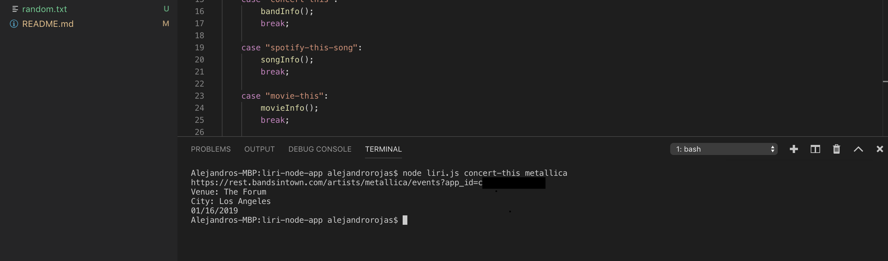
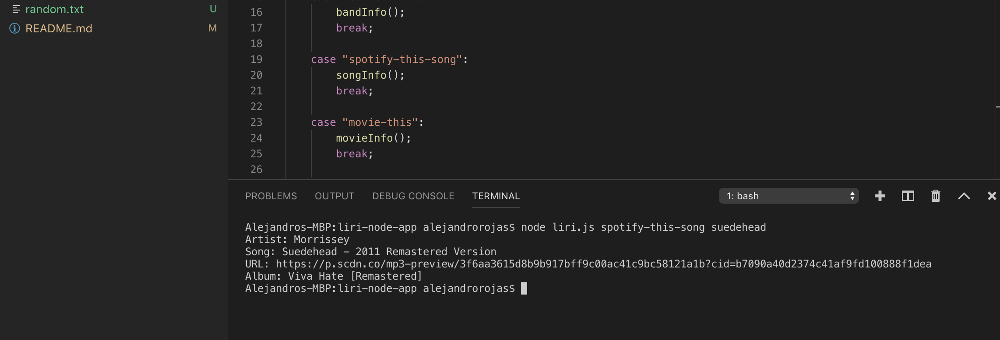
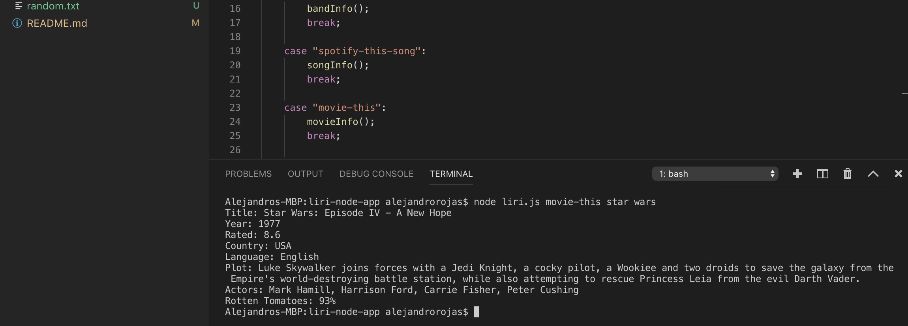
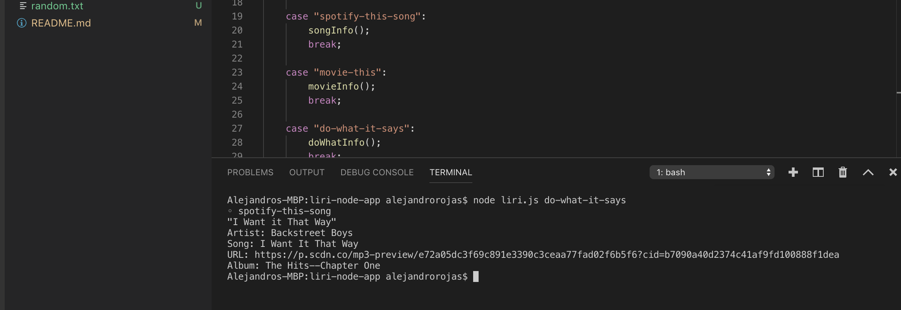

# LIRI Bot

## Overview
In this assignment, I made a LIRI. LIRI is like iPhone's SIRI. However, while SIRI is a Speech Interpretation and Recognition Interface, LIRI is a Language Interpretation and Recognition Interface. LIRI will be a **command line node app** that takes in parameters and gives you back data.

### Expected Outcomes
The LIRI Bot was designed to produce search results based on the following commands:

* node liri.js concert-this
* node liri.js spotify-this-song
* node liri.js movie-this
* node liri.js do-what-it-says

Each command produced different search results as listed below:

* node liri.js concert-this "artist/band name"
    * Name of venue
    * Venue location
    * Date of the event in MM/DD/YYYY format

* node liri.js spotify-this-song "song/track name"
    * Artist
    * Song
    * Spotify song preview url
    * Album

* node liri.js movie-this "movie title"
    * Title of the movie
    * Year the movie came out
    * IMDB Rating of the movie
    * Country where the movie was produced
    * Language of the movie
    * Plot of the movie
    * Actors in the movie
    * Rotten Tomatoes Rating of the movie

* node liri.js do-what-it-says
    * Print the spotify results for "I want it that way" stored in the random.txt file

### Code by Command

#### concert-this
This command used the Bands in Town Artist Events API.  An axios.get sent the search request and the results were console.logged using **moment** to change the format of the returned date.

```javascript
var queryURL = "https://rest.bandsintown.com/artists/" + bandName + "/events?app_id=[key]";
    
    console.log(queryURL); 

    axios.get(queryURL).then(
        function(bandResponse){
            console.log("Venue: " + bandResponse.data[0].venue.name);
            console.log("City: " + bandResponse.data[0].venue.city);
            console.log(moment(bandResponse.data[0].datetime).format("MM/DD/YYYY"));
        }
    );
};
```
#### spotify-this-song
This command used the Spotify request API.  A node-spotify-api spotify.request sent the search request and the results were console.logged.

```javascript
var spotify = new Spotify({
        id: spotifyKeyInfo["spotify"].id,
        secret: spotifyKeyInfo["spotify"].secret
    });

    spotify.request('https://api.spotify.com/v1/search?q=track:' + songName + '&type=track&limit=10', function(error, songResponse) {
        if (error){
            return console.log(error);
        }
        console.log("Artist: " + songResponse.tracks.items[0].artists[0].name);
        console.log("Song: " + songResponse.tracks.items[0].name);
        console.log("URL: " + songResponse.tracks.items[0].preview_url);
        console.log("Album: " + songResponse.tracks.items[0].album.name);
    });
};
```
#### movie-this
This command used the omdb API.  An axios.get sent the search request and the results were console.logged.

```javascript
var queryURL = "http://www.omdbapi.com/?t=" + movieName + "&y=&plot=short&apikey=[key]";

    axios.get(queryURL).then(
        function(movieResponse){
            console.log("Title: " + movieResponse.data.Title);
            console.log("Year: " + movieResponse.data.Year);
            console.log("Rated: " + movieResponse.data.imdbRating);
            console.log("Country: " + movieResponse.data.Country);
            console.log("Language: " + movieResponse.data.Language);
            console.log("Plot: " + movieResponse.data.Plot);
            console.log("Actors: " + movieResponse.data.Actors);
            console.log("Rotten Tomatoes: " + movieResponse.data.Ratings[1].Value);
        }
    );
};
```
#### do-what-it-says
This command pulled the spotify-this-song information from the local random.txt file.

```javascript
function doWhatInfo() {

    fs.readFile("random.txt", "utf8", function(error, data) {
      if (error) {
        return console.log(error);
      }
        var output = data.split(",");
        for (var i = 0; i < output.length; i++) {
            console.log(output[i]);
        }
      });
};
```
### Spotify API, Client ID & Client SECRET
The Spotify API requires developers to sign up and generate the necessary API credentials (client id and client secret):

* Step One: Visit https://developer.spotify.com/my-applications/#!/
* Step Two: Either login to your existing Spotify account or create a new one (a free account is fine) and log in
* Step Three: Once logged in, navigate to https://developer.spotify.com/my-applications/#!/applications/create to register a new application to be used with the Spotify API. When finished, click the "complete" button
* Step Four: On the next screen, scroll down to where you see your client id and client secret. Copy these values down somewhere, you'll need them to use the Spotify API and the node-spotify-api package.

As a security precaution the Spotify Client ID & SECRET were stored on a local .env file and added to a local .gitignore file to avoid publishing the information.

### Switch Statement
A Switch Statement was used to capture the unique user command line input.  This allowed LIRI to run the specific command that was entered by the user and access the appropriate code block.

```javascript
var userInput = process.argv;
var inputTopic = process.argv[2];


switch (inputTopic){
    case "concert-this":
        bandInfo();
        break;
    
    case "spotify-this-song":
        songInfo();
        break;
    
    case "movie-this":
        movieInfo();
        break;

    case "do-what-it-says":
        doWhatInfo();
        break;
}
```
### Creating the Search Variable
LIRI created a unique variable for each command based on the user input and identified Switch Statement.  Each command had a unique variable that was used to complete the API request.

```javascript
function bandInfo(){
    var bandName = "";
    for (var i = 3; i < userInput.length; i++){
        if (i > 3 && i < userInput.length){
            bandName = bandName + "+" + userInput[i];
        }
        else{
            bandName += userInput[i];
        }
    }
```
```javascript
function songInfo(){
    var songName = "";
    for (var i = 3; i < userInput.length; i++){
        if (i > 3 && i < userInput.length){
            songName = songName + "+" + userInput[i];
        }
        else{
            songName += userInput[i];
        }
    }
```
```javascript
function movieInfo(){
    var movieName = "";
    for (var i = 3; i < userInput.length; i++){
        if (i > 3 && i < userInput.length){
            movieName = movieName + "+" + userInput[i];
        }
        else{
            movieName += userInput[i];
        }
    }
```

### Require & Local Linked files
LIRI required installation of several npm packages and links to local files.

```javascript
require("dotenv").config();
var fs = require("fs");
var moment = require("moment");

var axios = require("axios");
var Spotify = require("node-spotify-api");

var spotifyKeyInfo = require("./keys.js");
```

## Screenshots

#### concert-this


#### spotify-this-song


#### movie-this


#### do-what-it-says

